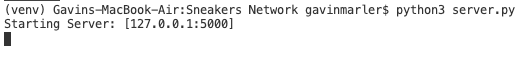
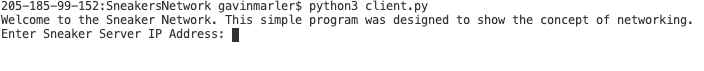

# Sneaker Network
## Overview
This program uses Python and sockets to connect to programs to eachother through networking. The IP address is needed, along with a certain port, in order for this to work.

## Development Environment
* VS Code
* Python 3.8.5

## Execution
To run and see both sides, open up two seperate terminals. then put: 
```python
python3 client.py
``` 
in one and in the other put: 
```python
python3 server.py
```

The ouput for the server side is like this:   


The ouput for the client side is like this:


## Useful Websites
* [Here](https://docs.python.org/3.8/) is the Python reference.
* [Here](https://stackoverflow.com) is Stack Overflow.
